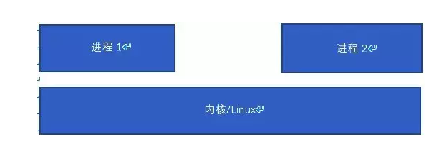
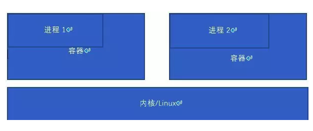
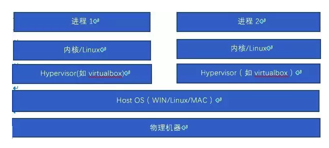
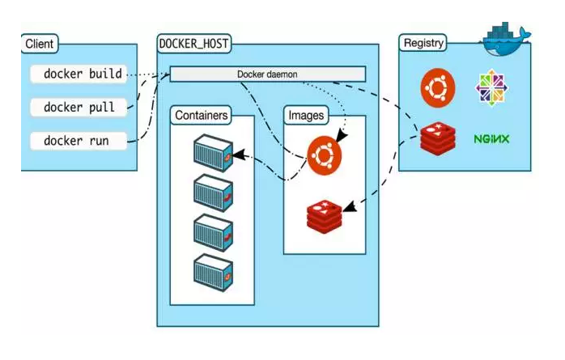
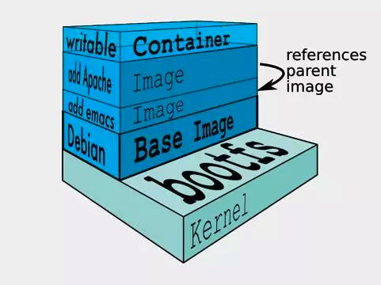

# Docker

## Docker是什么

​	KVM、Virtualbox、Vmware是虚拟出机器，让每个实例看到一个单独的机器；而Docker是虚拟出操作系统，实现应用之间的隔离，让各个应用觉得自己有一个自己的操作系统，而且彼此之间隔离。假设没有Docker，然后有进程1和进程2，它们的运行将类似下图，进程1和进程2共享kernel，它们是同一OS下2个进程，因此必须拥有不同PID，但是又共享网卡，共享IP地址，看到一样的根文件系统（不chroot的情况下）等，可以用Linux IPC手段进程间通信。

有Docker的情况下，假设进程1和进程2运行于不同的容器，那么进程1和进程2都觉得自己和对方没有半毛钱关系，都觉得自己拥有自己的根文件系统，自己的网卡等，然后进程1和进程2的PID还可以一样，比如假设2个都是100。但是，此100非彼100。

Virtualbox等虚拟机的思路则完全不一样，如果进程1和进程2运行于不同的虚拟机，则操作系统都是双份的，它们感觉自己在不同的虚拟电脑上面跑。

由于可见，Docker达到了类似虚拟机的效果，但是又没有虚拟机的开销，它虚拟的层次更加高。Docker不虚拟机器，仅仅虚拟应用的运行环境。

## Docker的架构

Docker中可能涉及到3个机器或者更多机器，一个运行Docker命令的client， 一个包含images并以容器（Container）形式运行image的主机，一个Docker的images仓库。client与docker host上面的docker daemon通信。当然docker client和host可以运行于一台机器（我们做实验的时候是一台），默认的Docker仓库是Docker Hub。

一般的流程中，client发pull命令从仓库把image拉到docker host，然后通过run命令指挥image到host上面弄一个Container来跑这个image。

当然也可以是相反的流程，client 通过build命令在host上面创建一个自己的image，然后通过push命令把image推到仓库。之后这个image可以被别的人或者自己pull。

## Image是什么

​	Docker镜像是一个特殊的文件系统，提供容器运行时所需的程序、库、资源、配置等文件外，还包含了一些为运行时准备的一些配置参数（如匿名卷、环境变量、用户等）。image为特定目的而生，比如弄了个Nginx的image后，这个image就把Nginx的东西包罗万象了，无论是张三、王五、六麻子还是七癞子，无论它是什么电脑，什么操作系统，只要支持Docker，它把这个Nginx的image下载下来后，拿docker run命令就可以弄容器跑Nginx了。这样，用户就不用装Nginx以及它依赖的一切包了。

镜像构建时，会一层层叠加，前一层是后一层的基础。

每一层构建完就不会再发生改变，后一层上的任何改变只发生在自己这一层。比如，删除前一层文件的操作，实际不是真的删除前一层的文件，而是仅在当前层标记为该文件已删除。所以这个很类似Git里面这一次提交相对于上一次提交的diff

这些叠加的最后一层就是Container，所以你在Container里面改了文件，其实不会进image。

