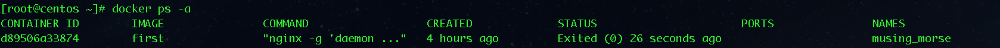

# Docker常用命令

首先先说一下，Docker的命令你可以查看这样查看

```
docker
```

然后出现下面的信息

```
Usage:	docker COMMAND

A self-sufficient runtime for containers

Options:
      --config string      Location of client config files (default "/root/.docker")
  -D, --debug              Enable debug mode
      --help               Print usage
  -H, --host list          Daemon socket(s) to connect to (default [])
  -l, --log-level string   Set the logging level ("debug", "info", "warn", "error", "fatal") (default "info")
      --tls                Use TLS; implied by --tlsverify
      --tlscacert string   Trust certs signed only by this CA (default "/root/.docker/ca.pem")
      --tlscert string     Path to TLS certificate file (default "/root/.docker/cert.pem")
      --tlskey string      Path to TLS key file (default "/root/.docker/key.pem")
      --tlsverify          Use TLS and verify the remote
  -v, --version            Print version information and quit

Management Commands:
  container   Manage containers
  image       Manage images
  network     Manage networks
  node        Manage Swarm nodes
  plugin      Manage plugins
  secret      Manage Docker secrets
  service     Manage services
  stack       Manage Docker stacks
  swarm       Manage Swarm
  system      Manage Docker
  volume      Manage volumes

Commands:
  attach      Attach to a running container
  build       Build an image from a Dockerfile
  commit      Create a new image from a container's changes
  cp          Copy files/folders between a container and the local filesystem
  create      Create a new container
  diff        Inspect changes to files or directories on a container's filesystem
  events      Get real time events from the server
  exec        Run a command in a running container
  export      Export a container's filesystem as a tar archive
  history     Show the history of an image
  images      List images
  import      Import the contents from a tarball to create a filesystem image
  info        Display system-wide information
  inspect     Return low-level information on Docker objects
  kill        Kill one or more running containers
  load        Load an image from a tar archive or STDIN
  login       Log in to a Docker registry
  logout      Log out from a Docker registry
  logs        Fetch the logs of a container
  pause       Pause all processes within one or more containers
  port        List port mappings or a specific mapping for the container
  ps          List containers
  pull        Pull an image or a repository from a registry
  push        Push an image or a repository to a registry
  rename      Rename a container
  restart     Restart one or more containers
  rm          Remove one or more containers
  rmi         Remove one or more images
  run         Run a command in a new container
  save        Save one or more images to a tar archive (streamed to STDOUT by default)
  search      Search the Docker Hub for images
  start       Start one or more stopped containers
  stats       Display a live stream of container(s) resource usage statistics
  stop        Stop one or more running containers
  tag         Create a tag TARGET_IMAGE that refers to SOURCE_IMAGE
  top         Display the running processes of a container
  unpause     Unpause all processes within one or more containers
  update      Update configuration of one or more containers
  version     Show the Docker version information
  wait        Block until one or more containers stop, then print their exit codes

Run 'docker COMMAND --help' for more information on a command.
```

以上就是所有的docker的命令，你也可以使用如下指令来查看docker中更加详细的配置项

```
docker COMMAND --help
```

下面介绍一下常用的命令吧：

- docker ps   显示正在运行的容器
- docker ps -a  显示所有的容器，包括暂停的
- docker images  显示所有镜像
- docker rm 容器ID   删除某个容器
- docker rmi 镜像ID  删除某个镜像

注意 删除操作的时候有一个稍微可以让你简单一点点的小技巧

​	

这时候你想要删除这个容器的话，你可以直接输入

```
docker rm d 
```

就可以了，因为因为开头为d的只有那么一个，所以docker可以找到，所有操作都可以这样做，只要你给的标识唯一的话，docker就可以进行操作

- docker build -t tag .  构建镜像，tag用于标示这个镜像，后面的 . 表示Dockerfile在当前目录，如果Dockerfile不在当前目录需要将Dockerfile的路径完整写上去
- docker run -p 80:80 -d tag   运行这个容器，-p表示本地80端口映射到容器80端口以后面的端口运行， -d表示后台运行
- docker stop/start/restart tag  表示停止，开启，重启容器
- docker exec -it 665b4a1e17b6 /bin/sh 执行shell命令