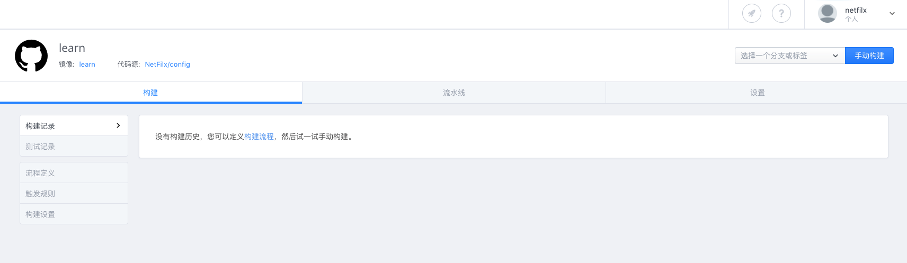
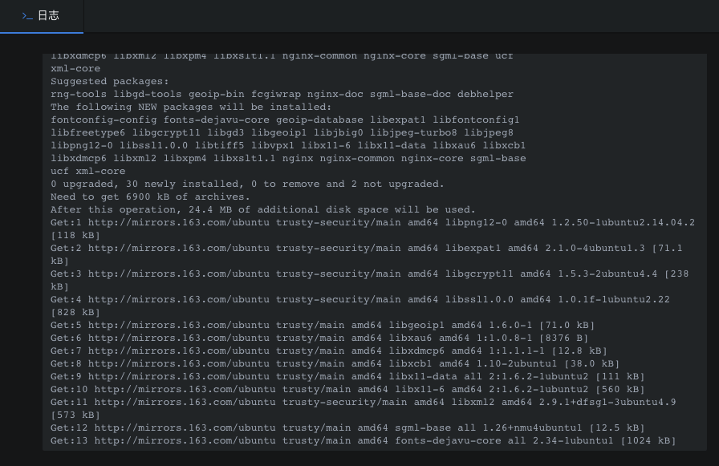
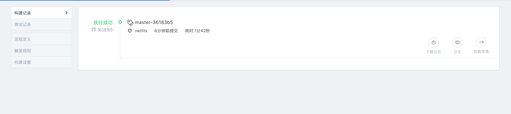
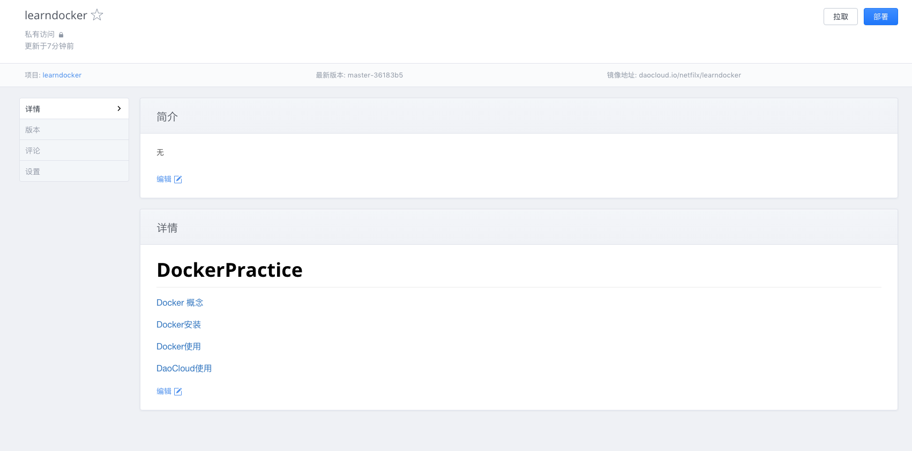
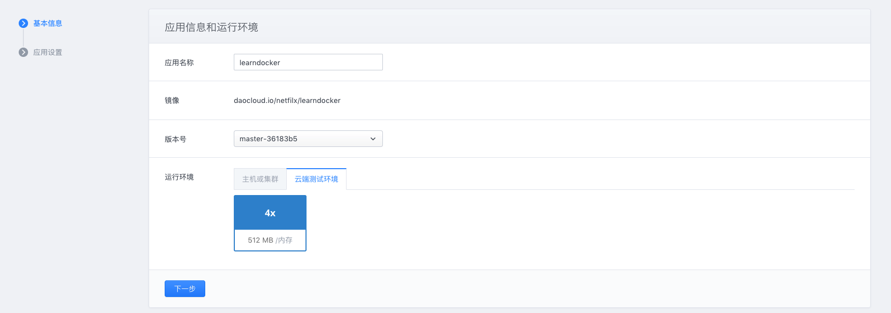
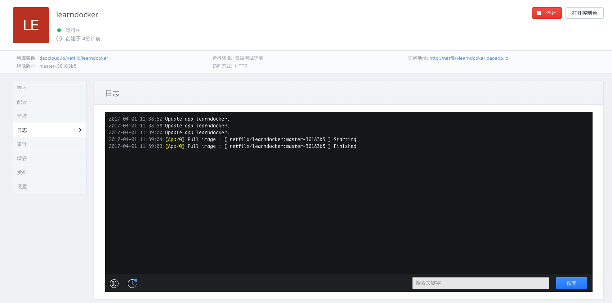

# 使用DaoCloud

​	如果我们自己没有服务器，刚刚的网页我们只能在本地访问，好可惜。别急，现在我要隆重介绍一个Docker的好伙伴——DaoCloud，官网传送门：[https://www.daocloud.io/](https://account.daocloud.io/signup?invite_code=tqnulhtt2zsoh3p8npcu)

​	有了DaoCloud，我们只需要负责写Dockerfile，剩下的build、运行之类的东西都交给DaoCloud，我们只需要点一点按钮即可。

​	DaoCloud会将Github、GitCafe等git服务商作为代码源，这里我使用Github

​	填写完项目名称之后，选择GitHub然后同步代码源，之后会让你进行一个授权，这些结束之后大致是这样的

你的头像下面有一个下拉框，选择你要的仓库即可

点击下面的开始创建即可，结束之后，页面如下：

在右上角选择一个分支，选好之后点击手动构建，这样DaoCloud就会自动寻找你项目下的Dockerfile(我的Dockerfile放在最外面的)，下面就会跳出和在本地构建一样的的日志信息

结束后，点击空白地方即可

仅仅是构建镜像没什么意思， DaoCloud还可以将这个镜像在云端运行起来。我们点击右下角的查看镜像按钮，跳转到如下页面：

这里就是你的镜像的详情，有了镜像我们就可以部署了，点击右上角的部署，来到下面的界面，按照下图进行设置

点击下一步

出现下面的就已经部署好了

点击上右上方的一个访问地址即可。

